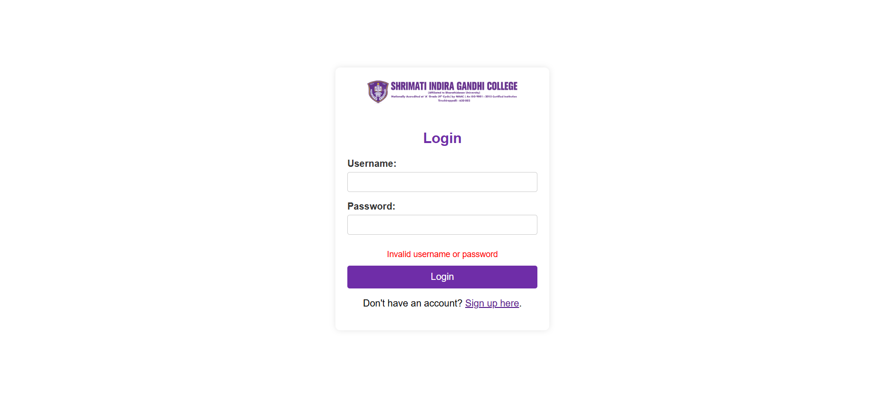
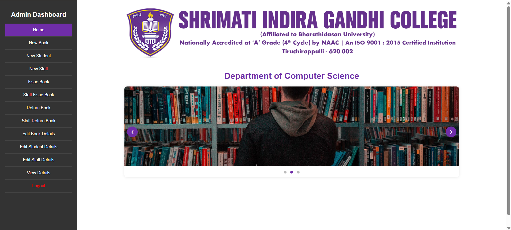

# 📚 Library Management System

The Library Management System was developed as a **freelance project** for **Shrimati Indira Gandhi College**, a prestigious women's institution located in **Tiruchirappalli, Tamil Nadu**. It streamlines essential library operations like **book inventory**, **student and staff memberships**, **issue and return tracking**, and **report generation**.

<div align="center">

</div>

---

## ✨ Features

- 🔐 Admin Login & User Registration  
- 👩‍🎓 Student and 👩‍🏫 Staff Membership Management  
- 📚 Book Management (Add, Edit, Delete) with metadata  
- 📤 Book Issue and 📥 Return with fine calculation  
- 📩 Email Notifications for issue and return reminders  
- 📅 Due Date Management and Renewals  
- 🧾 Auto Fine Calculation  
- 📊 PDF Report Generation (Students, Staff, Issued/Returned Books)  
- 🖥️ Clean Web UI built with Flask  

---

## 🛠️ Tech Stack

- **Frontend**: HTML, CSS (via Jinja2 Templates)  
- **Backend**: Python (Flask Framework)  
- **Database**: Microsoft SQL Server  
- **Email Service**: SMTP (Gmail)  
- **PDF Reporting**: ReportLab  
- **Security**: Hashed Passwords (Werkzeug)

---

## ⚙️ Installation

1. Clone the repository:
```
git clone https://github.com/narain-karthik/Library-Management-System.git
cd library-management-system
```

2. Create virtual environment (optional but recommended):
```
python -m venv venv
venv\Scripts\activate  (or source venv/bin/activate on Linux/Mac)
```

3. Install dependencies:
```
pip install -r requirements.txt
```

4. Set up your `.env` file with:
```
EMAIL_USER=your_gmail@gmail.com  
EMAIL_PASS=your_app_password
```

5. Run the application:
```
python main.py
```

---

## 📥 How to Use SQL Server Script

1. **Open SQL Server Management Studio (SSMS)**  
   Download it from [Google Drive link](https://drive.google.com/drive/folders/1M5rDp60hMO5Gc37dEG8kMab-iBV88XEM?usp=drive_link).

2. **Connect to your SQL Server 2008 instance**  
   Use Windows or SQL Authentication as per your setup.

3. **Open a New Query Window**  
   Click on **New Query** at the top-left.

4. **Paste the SQL Script**  
   Paste the provided `.sql` script into the window.

5. **Execute the Script**  
   Click **Execute** or press `F5` to create the `LibraryDB` and all required tables.

---
## 📸 Screenshots

<div align="center">

<br><br>

<br><br>

</div>

---

## 🧑‍💻 Developers

This project was developed by:

**Narain Karthik Jayakumar**  
- Network Engineer & Developer  
- LinkedIn: [Narain Karthik Jayakumar](https://www.linkedin.com/in/narain-karthik-jayakumar-a635931b1)  
- Email: narainjkans@yahoo.com  

---

## 📜 License

This project is licensed under the **MIT License** – use it freely, contribute back, and give credit where due.

---

## ⚠️ Disclaimer

This application is built for educational and academic institutional purposes. Ensure that any modifications or deployments comply with your organization's policies.

